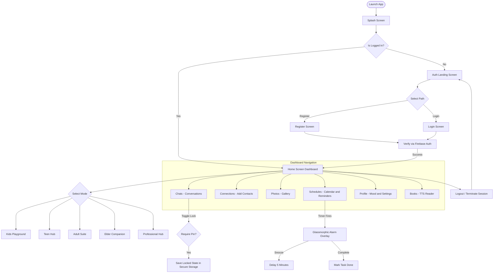

# 🌈 MMWelconm — Next-Gen Social Connection Platform

### **Connect Your Mood. Share Your Status. Stay Close — At Every Age.**

A premium, Flutter-based multi-generational social utility designed for close circles — family, friends, and partners — to share real-time moods, coordinate availability, manage finances, access wellness tools, and communicate securely. Built with age-adaptive interfaces that cater to Kids (5–12), Teens (13–19), Adults (20–55), Elders (55+), and Professionals.

---

## 🛠️ Tech Stack & Badges

[](https://flutter.dev)
[](https://dart.dev)
[](https://firebase.google.com)
[](https://cloudinary.com)
[](https://github.com)
[](https://github.com)
[](https://mm-welconm.web.app)

---

## 📋 Table of Contents

- [Project Metadata](#project-metadata)
- [1. Project Overview](#1-project-overview)
- [2. Problem Statement](#2-problem-statement)
- [3. Solution](#3-solution)
- [4. Features](#4-features)
  - [Core Platform Features](#core-platform-features)
  - [Kids Mode (Age 5–12)](#-kids-mode-age-512)
  - [Teen Mode (Age 13–19)](#-teen-mode-age-1319)
  - [Adult Mode (Age 20–55)](#-adult-mode-age-2055)
  - [Elder Mode (Age 55+)](#-elder-mode-age-55)
  - [Professional Mode](#-professional-mode)
  - [Payment System](#-payment-system)
  - [Book Reader](#-book-reader)
  - [Multi-Language Support](#-multi-language-support)
  - [AI and Gamification](#-ai--gamification)
- [5. Technology Stack](#5-technology-stack)
- [6. System Architecture](#6-system-architecture)
- [7. UI Design](#7-ui-design)
- [8. Project Workflow](#8-project-workflow)
- [9. Folder Structure](#9-folder-structure)
- [10. Installation](#10-installation)
- [11. Usage](#11-usage)
- [12. Challenges Faced](#12-challenges-faced)
- [13. Future Improvements](#13-future-improvements)
- [14. Conclusion](#14-conclusion)
- [15. References](#15-references)
- [16. License](#16-license)

---

## Project Metadata

| Field | Details |
|:---|:---|
| **Project Title** | MMWelconm – Multi-Generational Social Connection Platform |
| **Version** | 1.3.0+6 |
| **Author** | Asma Begum Mohd. |
| **Date** | July 2026 |
| **Live URL** | [https://mm-welconm.web.app](https://mm-welconm.web.app) |
| **Platforms** | Android · iOS · Web |

---

## 1. Project Overview

**mmwelconm** is a private, real-time, multi-generational social connection platform engineered for close-knit circles — family, friends, and partners. Unlike traditional social networks that prioritize public broadcasting, mmwelconm focuses on localized utility: enabling users of all ages to share moods, coordinate plans, drop media, manage health, access finances, and stay safe.

The platform delivers **five tailored age-adaptive interfaces** — Kids, Teen, Adult, Elder, and Professional — each with its own visual design language, feature set, and accessibility configuration. The core engine is backed by Firebase for real-time sync, Cloud Firestore for data persistence, and Cloudinary for cross-platform media hosting.

---

## 2. Problem Statement

Modern social networks focus on high-frequency public broadcasting, leading to oversharing, notification fatigue, and a decline in digital privacy. Families struggle to coordinate across age groups on a single platform:

- **Parents** need child-safe, parent-controlled spaces for their kids.
- **Teenagers** need expressive, social, and productivity-focused environments.
- **Adults** need work/life balance tools with professional-grade utilities.
- **Elders** need large-text, high-contrast, voice-friendly interfaces with health reminders.
- **Professionals** need admin-controlled, clean dashboards with meeting management.

No existing app unifies all these needs under one roof with meaningful differentiation between age groups and roles.

---

## 3. Solution

**mmwelconm** addresses these issues through a unified platform with deep specialization per user group:

- **Age-Adaptive Interfaces:** Five distinct modes — each with its own color palette, layout complexity, animation style, and feature set — selected automatically or manually via user profile settings.
- **Ambient Mood Tracking:** Real-time emoji-based mood updates visible to connected circles, eliminating repetitive check-ins.
- **Smart Reminders and Alarms:** In-chat task imports, calendar schedules, and glassmorphic full-screen alarms with snooze/complete actions.
- **Granular Privacy and Safety:** Chat locks, parent controls, SOS buttons, inactivity alerts, and account deletion workflows.
- **Integrated Finance:** Age-gated payment systems (UPI, bank, QR) with minor and adult spending limits.
- **Book Reader and Multilingual Support:** TTS-powered novel reading with male/female voices and full Hindi/Telugu language support.

---

## 4. Features

### Core Platform Features

#### 🔐 User Profiles and Authentication
- **Unique MM ID:** Each user gets a unique `MMXXXXXX` identifier for private contact search and invite flow.
- **Profile Customization:** Custom avatars, profile photos, bios, and online status toggles saved to Firebase.
- **Account Deletion Workflow:** Users can request account deletion from the Account section. The account is queued for permanent cloud deletion after **24 hours**. If the user logs back in within that window, the deletion is automatically cancelled and the account is fully restored.
- **Online/Offline Visibility:** Toggle active status in settings at any time.

#### 💬 Rich, Group-Categorized Chat
- **Relationship Themes:** Conversations auto-color based on relation type:
  - 🏠 **Family** → Blue
  - 👯 **Friends** → Purple
  - ❤️ **Partner** → Pink
- **Modern Chat Status Indicators:** Messages display animated pill-style status badges:
  - 📤 **SENT** — Message delivered to server
  - 📬 **DELIVERED** — Received on recipient's device
  - 👁️ **READ** — Opened by recipient (with timestamp)
- **Advanced Message Management:** Real-time read receipts, unread badges, editing (within 15 mins), single/bulk deletion, and chat clearing.
- **Media Uploads:** Send from gallery or camera, cross-platform compatible.

#### ⏰ Schedules, Calendar, and Reminders
- **Full Calendar Integration:** Built-in monthly calendar view with event creation and management.
- **Text-to-Task Conversion:** Long-press any chat message to convert it to a scheduled reminder.
- **Overlay Alarm System:** Glassmorphic full-screen alarm overlay at trigger time with **Snooze (5 min)** and **Complete** actions.

#### 🔒 Privacy Controls
- **Chat Lock Manager:** PIN/pattern locks on individual chats using secure hardware-backed local key storage.
- **Per-Contact Privacy Toggles:** Disable location or status shares on a per-contact basis.

#### 🔡 Font Size Control
- **Global Font Scaling:** Font size increase/decrease control accessible from Settings, applied across all modes including footer labels and navigation elements.

#### 🎨 Theme System
- **Full-App Theme Application:** When a theme is changed, all UI elements — headers, footers, back buttons, overlays, and navigation bars — update consistently for full visual coherence.

---

### 🧒 Kids Mode (Age 5–12)

A joyful, safe, and parent-supervised playground designed for young children.

#### Visual Design
- **Giant Animated Emojis (120x120):** Emojis bounce on tap — 😊 😢 😴 😎 🤗 🎉 📚 — in vivid primary colors.
- **Animated Cartoon Backgrounds:** Children choose from Space, Ocean, or Forest themes. Swipe left/right to switch.
- **Colorful Chat Bubbles:** Yellow for Family, Green for Friends, Pink for Teachers — all with friendly rounded corners.

#### Navigation
- **3-Button Layout:** Chat · Mood · Photos — icons only, no text labels required.
- **Voice Guidance:** Spoken prompts like *"Tap here to chat!"* guide young users.
- **Swipe Gestures:** Left/right swipes change background themes.

#### Parent Controls
- **Friend Approval Required:** Children cannot add friends without parent review and approval.
- **Screen Time Limits:** Parents set daily usage caps (1 hr, 2 hrs, etc.). Auto-locks after the limit with countdown.
- **Mood Check-Ins:** Daily emoji mood log for children with a parent dashboard view.
- **Content Safety Filters:** All content goes through age-appropriate filters with automatic blocking.
- **Voice-to-Text Mood Updates:** Children can speak their mood instead of typing.
- **Cartoon Stickers in Chat:** Pre-approved sticker packs for expressive communication.

---

### 🎮 Teen Mode (Age 13–19)

An expressive, social, and productivity-focused environment built for teenagers.

#### Visual Design
- **Trendy Themes:** Dark Mode (default), Purple-Pink Gradient, Blue-Green Gradient, Anime/Manga, Neon Gaming.
- **Customizable Profile:** Multiple avatars (carousel), bio editor, interest tags (Gaming, Music, Sports, Art), and a Mood Board.
- **Animated Moods:** Smooth emoji transitions, particle effects (stars, sparkles, hearts), GIF moods, and custom emoji mashup creator.
- **Gradient Chat Bubbles:** Purple-Pink for Friends, Blue-Green for Family, Red-Orange for Partner. Color palette picker included.

#### Social Features
- **Mood Stories (24 hrs):** Share photo/music-enriched mood stories with friends for 24 hours.
- **Reaction System:** React buttons (😍🔥👍) on stories and posts.
- **Squad Mood Average:** Collective mood display for a group as an emoji average.
- **Weekly Mood Stats:** Bar graph showing mood trends across the week.

#### Productivity and Study
- **Exam Countdown Cards:** Visual countdown to upcoming exams.
- **Pomodoro Focus Timer:** Built-in timer with ambient sound equalizer visualizer.
- **Homework Checklist:** Priority-based task list (High/Medium/Low) with subject mood tracking.

#### Health and Wellness
- **Sleep Stars Tracker:** Rate sleep quality (1–5 stars) nightly.
- **Stress Level Selector:** Daily stress input with monthly anxiety trend scale.
- **24-Hour Digital Detox Challenge:** Opt-in daily screen time detox mode.

#### Payment System (Teen — Minor)
- Bank account and UPI linking with a **Rs. 5,000/day** spending limit enforced for minors.
- QR code payment simulation with instant visual feedback.

---

### 💼 Adult Mode (Age 20–55)

A clean, professional-grade suite balancing work, family, health, and finance.

#### Quick Actions
- One-tap Mood (Happy/Busy/Tired), Location (Home/Work/Out), and Status dropdowns on the dashboard header.

#### Work and Productivity
- **Meeting Board:** Upcoming meetings list with time and agenda.
- **Commute ETA Widget:** Real-time traffic status (e.g., *"30 mins left — heavy traffic"*).
- **Vacation Countdown Planner:** Tracks days until planned holidays.
- **Focus / Work Mode:** Dedicated distraction-free focus session with Pomodoro-style timer.

#### Family Management
- **Shared Family Calendar:** Event logs synced across the entire household.
- **Grocery Checklist:** Shared shopping list synced across family members.
- **Chore Rotation:** Assigned chore schedule for household members.
- **Parent-Teen Mood Bridge:** View teen mood check-ins directly from the adult dashboard.

#### Health and Wellness
- **Breathing Meditation Sphere:** Animated inhale/exhale sphere for guided breathing sessions.
- **Meal Logging:** Breakfast, Lunch, and Dinner completion checklist.
- **Exercise and Gym Logs:** Activity tracker with duration and type input.

#### Finance
- **Bill Reminder Scheduler:** Upcoming bill dates with auto-alerts.
- **Monthly Budget Tracker:** Spent vs. budget progress bar visualization.
- **Savings Goal Tracker:** Personal savings goal with progress indicator.

#### Payment System (Adult — Major)
- Bank account, UPI, and QR code payments with a **Rs. 1,00,000/day** limit.
- Near-instant transfer simulation with live progress indicators and success/error dialogs.

---

### 👴 Elder Mode (Age 55+)

A highly accessible, safety-first companion designed for seniors.

#### Accessibility
- **Extra-Large Text Mode:** 200% bold font scaling throughout the UI.
- **High Contrast Mode:** Cream/dark high-contrast layout with maximum readability.
- **Simple Navigation:** Only 3 large navigation buttons — no complex menus.
- **Voice Commands:** Simulated voice input (e.g., *"Call my son"*, *"Set reminder"*).

#### Dashboard
- **Giant Mood Emojis (150x150):** Happy 😊, Sad 😢, Tired 😴, Cool 😎 with large descriptive text below each.

#### Health and Safety
- **Medicine Reminder Timers:** Checklist of medications with scheduled alerts.
- **Doctor Appointment Countdown:** Days remaining until next appointment.
- **Health Logs:** Blood pressure entry (e.g., 120/80) and blood sugar tracking.
- **One-Tap Emergency SOS:** Giant red button that alerts all connected family members instantly.
- **Inactivity Safety Checker:** If no interaction is detected for 40 seconds, prompts *"Are you okay?"*. No response triggers an automatic welfare alert to family.

#### Social and Connection
- **One-Tap Status Updates:** Large buttons for *"At Home"*, *"At Doctor"*, *"Going Out"*.
- **Grandkids Mood View:** See family members' moods with a **Send Love** button.
- **Family Memories Gallery:** Shared photo memories from the family album.

#### Payment System (Elder — Major)
- Simplified interface with Bank, UPI, and QR payments — **Rs. 1,00,000/day** limit with large tap targets and clear confirmations.

---

### 🏢 Professional Mode

A clean, administrator-controlled workspace for professional environments.

#### Admin Controls
- **Admin Dashboard:** Centralized control panel showing all team member accounts.
- **Account Management:** Admin can enable or disable specific feature access per user.
- **User ID System:** Each member is assigned a professional ID under the admin's organization.

#### Meeting Management
- **Meeting Scheduler:** Create, edit, and manage meetings with title, date, time, and agenda.
- **Participant Management:** Add/remove participants by MM ID or professional ID.
- **Meeting Reminders:** Automated alerts before scheduled meetings.

#### Finance (Professional — Major)
- Secure Bank, UPI, and QR code payments with **Rs. 1,00,000/day** limit.
- Transaction logs and receipt summaries.

#### Design Language
- Minimal, clean layout with a professional dark-navy/slate color palette.
- All interactions are purposeful and efficient — no decorative animations.

---

### 💳 Payment System

An integrated, multi-modal payment system accessible across Teen, Adult, Elder, and Professional modes.

| Feature | Teen (Minor) | Adult / Elder / Professional (Major) |
|:---|:---|:---|
| **Daily Limit** | Rs. 5,000 | Rs. 1,00,000 |
| **Bank Account Linking** | Yes | Yes |
| **UPI Payment** | Yes | Yes |
| **QR Code Scan/Pay** | Yes | Yes |
| **Transfer Speed** | Seconds | Seconds |
| **Live Progress Indicator** | Yes | Yes |
| **Success/Error Dialog** | Yes | Yes |

---

### 📖 Book Reader

A built-in TTS-powered book reading feature accessible from the Books section.

- **Tap-to-Read:** Clicking the cover image of any novel opens the Reader view.
- **Male and Female Voice:** Choose between a male or female narrator voice.
- **Accurate English Accent:** Proper British/American English pronunciation via the device TTS engine.
- **Playback Controls:** Play, Pause, Skip Chapter, and Speed control (0.5x, 1x, 1.5x, 2x).
- **Highlighted Text:** The currently spoken sentence is highlighted in the text view.

---

### 🌐 Multi-Language Support

The app supports switching the default display language from within Settings.

| Language | Code | Status |
|:---|:---|:---|
| English | `en` | Default |
| Hindi | `hi` | Supported |
| Telugu | `te` | Supported |

- All UI labels, navigation text, prompts, and notifications update when the language is changed.
- Language preference is persisted locally via `SharedPreferences`.

---

### 🤖 AI and Gamification

#### AI Mood Detection
- Analyzes message tone and chat patterns to suggest mood tags automatically.
- Visual mood meter updated in real time based on detected emotional state.

#### Gamification System
- **Streaks:** Daily login and mood-sharing streaks tracked and displayed.
- **Badges:** Achievement badges earned for milestones (e.g., 7-day streak, first payment, first story shared).
- **Progress Board:** Visual dashboard showing earned badges, current streak count, and next milestone.

---

## 5. Technology Stack

| Category | Technology | Usage |
| :--- | :--- | :--- |
| **Frontend** | Flutter 3.x / Dart | Cross-platform UI, animations, adaptive layouts |
| **Backend** | Firebase Auth, Firestore, Cloud Messaging | Authentication, real-time DB sync, push notifications |
| **Media Hosting** | Cloudinary REST API & Firebase Storage | Cross-platform image uploads (Base64/multipart) |
| **Local Storage** | Flutter Secure Storage & SharedPreferences | Chat lock keys, app settings, language preference |
| **Notifications** | `flutter_local_notifications` | Background timers, scheduled alarms, medicine alerts |
| **Sharing** | `share_plus` | Native OS share sheets |
| **URL Handling** | `url_launcher` | External link opening |
| **Home Widgets** | `home_widget` | OS-level home screen status widgets |
| **HTTP Client** | `http` | Cloudinary multipart uploads, REST API calls |
| **Dev Tools** | VS Code, Git, GitHub, Android SDK | Development, version control, deployment |

### Key Dependencies (pubspec.yaml)

```yaml
dependencies:
  firebase_core: ^4.11.0
  firebase_auth: ^6.5.3
  cloud_firestore: ^6.6.0
  firebase_messaging: ^16.4.1
  firebase_storage: ^13.4.3
  firebase_remote_config: ^6.5.3
  flutter_local_notifications: ^18.0.1
  flutter_secure_storage: ^9.0.0
  image_picker: ^1.2.2
  shared_preferences: ^2.5.5
  share_plus: ^10.1.0
  url_launcher: ^6.3.0
  http: ^1.6.0
  transparent_image: ^2.0.0
  home_widget: ^0.7.0
  vector_math: ^2.1.4
```

---

## 6. System Architecture

```mermaid
graph TD
    classDef client fill:#e8f0fe,stroke:#4285f4,stroke-width:2px,color:#000;
    classDef firebase fill:#fef7e0,stroke:#f4b400,stroke-width:2px,color:#000;
    classDef cloud fill:#e6f4ea,stroke:#0f9d58,stroke-width:2px,color:#000;
    classDef local fill:#fce8e6,stroke:#d93025,stroke-width:2px,color:#000;
    classDef mode fill:#f3e8fd,stroke:#9c27b0,stroke-width:2px,color:#000;

    FlutterApp["Flutter Frontend Client (Mobile / Web)"]:::client

    subgraph Age Modes
        KidsMode["Kids Mode (5-12)"]:::mode
        TeenMode["Teen Mode (13-19)"]:::mode
        AdultMode["Adult Mode (20-55)"]:::mode
        ElderMode["Elder Mode (55+)"]:::mode
        ProfMode["Professional Mode"]:::mode
    end

    FirebaseAuth["Firebase Authentication (Secure Sign-in and MM ID)"]:::firebase
    Firestore["Cloud Firestore (Real-time Sync: Chats, Moods, Payments)"]:::firebase
    FirebaseStorage["Firebase Storage (Profile Images and Media)"]:::firebase
    CloudinaryAPI["Cloudinary REST API (Web Image Uploads)"]:::cloud
    FCM["Firebase Cloud Messaging (Push Alerts and Reminders)"]:::firebase
    SecureStorage["Flutter Secure Storage (Chat Lock Keys)"]:::local
    SharedPreferences["Shared Preferences (Language, Theme, Settings)"]:::local

    FlutterApp --> KidsMode
    FlutterApp --> TeenMode
    FlutterApp --> AdultMode
    FlutterApp --> ElderMode
    FlutterApp --> ProfMode

    FlutterApp -->|Credentials| FirebaseAuth
    FlutterApp -->|Sync Collections| Firestore
    FlutterApp -->|Media Uploads| FirebaseStorage
    FlutterApp -->|Multipart HTTP Post| CloudinaryAPI
    FCM -->|Push Notification Triggers| FlutterApp
    FlutterApp -->|Read/Write Lock Status| SecureStorage
    FlutterApp -->|Read/Write App States| SharedPreferences
```



---

## 7. UI Design

The app delivers five visually distinct experiences tailored to each user group:

| Mode | Color Palette | Typography | Key Visual Elements |
|:---|:---|:---|:---|
| **Kids** | Primary colors (Red, Blue, Yellow, Green) | Rounded, playful | 120x120 bouncing emojis, cartoon backgrounds |
| **Teen** | Neon gradients, dark mode | Bold, edgy | Particle effects, gradient bubbles, anime themes |
| **Adult** | Blue/gray minimalist | Clean, sans-serif | Work cards, health meters, compact dashboards |
| **Elder** | Cream, high-contrast | Extra-large, bold | 150x150 emojis, large SOS button, 3-button nav |
| **Professional** | Dark navy/slate | Monospace/professional | Admin panels, meeting cards, finance ledger |

### Core Screens
- **Authentication:** Secure sign-in/registration with profile picture upload and MM ID generation.
- **Home Dashboard:** Centralized hub with mood widgets, navigation tabs, and notification feeds.
- **Age Mode Hub:** Dedicated full-screen suite per age group accessible from settings or home.
- **Chat Detail:** Categorized chat with animated READ/DELIVERED/SENT status pill badges.
- **Payment Center:** Bank, UPI, and QR payment flows with live progress indicators.
- **Book Reader:** Cover-tap-to-read with TTS playback and sentence highlighting.
- **Calendar:** Monthly view with event creation, reminders, and task imports from chat.
- **Settings:** Font size, theme, language selector, account management, and deletion workflow.

---

## 8. Project Workflow



---

## 9. Folder Structure

```
mmwelconm/
├── android/                              # Android native config and build scripts
├── ios/                                  # iOS native config and plist files
├── assets/
│   └── logo.png                          # App branding asset
├── functions/                            # Firebase Cloud Functions (Node.js)
├── lib/
│   ├── main.dart                         # App initialization, routes and background processes
│   ├── firebase_options.dart             # Auto-generated Firebase client configs
│   ├── models/
│   │   ├── chat_model.dart               # Message and chat session schemas
│   │   ├── contact_model.dart            # Friendship statuses and relationship types
│   │   ├── mood_model.dart               # Mood status emojis and text structures
│   │   ├── reminder_model.dart           # Task description, scheduled datetime and status
│   │   └── user_model.dart               # User details, MM ID, photo, status fields
│   ├── screens/
│   │   ├── auth_landing_screen.dart      # Initial gateway page
│   │   ├── chat_detail_screen.dart       # Message history, animated status badges
│   │   ├── chats_screen.dart             # Chat list categorized by relationship
│   │   ├── connections_screen.dart       # Contacts, incoming and outgoing requests
│   │   ├── create_group_screen.dart      # Group setup dialog
│   │   ├── home_screen.dart              # Main UI shell with navigation and mode routing
│   │   ├── kids_playground_screen.dart   # Kids Mode — animated, parent-controlled
│   │   ├── teen_hub_screen.dart          # Teen Mode — themes, social, study, health
│   │   ├── adult_suite_screen.dart       # Adult Mode — work, family, health, finance
│   │   ├── elder_companion_screen.dart   # Elder Mode — large UI, health, SOS
│   │   ├── professional_hub_screen.dart  # Professional Mode — admin, meetings, finance
│   │   ├── login_screen.dart             # Email-based login interface
│   │   ├── photos_screen.dart            # Shared image board
│   │   ├── privacy_settings_screen.dart  # Location and status toggles
│   │   ├── profile_screen.dart           # User bio, mood configurator, account settings
│   │   ├── register_screen.dart          # Signup with profile picture upload
│   │   ├── reminders_screen.dart         # Calendar schedules and alarm configurations
│   │   ├── requests_screen.dart          # Friend requests review panel
│   │   ├── settings_screen.dart          # System params, font size, language, theme
│   │   ├── splash_screen.dart            # Splash loader screen
│   │   └── todo_screen.dart              # Personal task management board
│   ├── services/
│   │   ├── auth_service.dart             # Sign-in, register and session management
│   │   ├── cloudinary_service.dart       # Direct HTTP upload to Cloudinary buckets
│   │   ├── firestore_service.dart        # Transactional reads/writes to DB collections
│   │   ├── lock_manager.dart             # Secure storage encryption key controls
│   │   ├── notification_service.dart     # FCM listeners and local notification alarms
│   │   └── storage_service.dart          # Cloud storage refs and upload helpers
│   └── widgets/
│       ├── app_brand.dart                # Reusable logo and brand text assets
│       └── notification_card.dart        # In-app drop-down notification cards
├── pubspec.yaml                          # Project plugins, version and assets registry
├── firebase.json                         # Firebase hosting and functions config
├── firestore.rules                       # Firestore security rules
└── storage.rules                         # Firebase Storage security rules
```

---

## 10. Installation

### Prerequisites
- **Flutter SDK:** v3.12.1 or newer
- **Dart SDK:** Bundled with Flutter
- **IDE:** VS Code or Android Studio with Flutter and Dart plugins
- **Emulator / Device:** Android Emulator, iOS Simulator, or USB-connected physical device with debugging enabled

### Setup Instructions

1. **Clone the Repository:**
   ```bash
   git clone https://github.com/mohdasmabegum/mmwelconm.git
   cd mmwelconm
   ```

2. **Install Dependencies:**
   ```bash
   flutter pub get
   ```

3. **Configure Firebase:**
   Place the Firebase config files in their respective platform folders:
   - **Android:** `android/app/google-services.json`
   - **iOS:** `ios/Runner/GoogleService-Info.plist`
   
   Or use the FlutterFire CLI:
   ```bash
   dart pub global activate flutterfire_cli
   flutterfire configure
   ```

4. **Set Up Key Properties (Android Release Builds):**
   ```bash
   cp key.properties.example key.properties
   ```
   Then populate with your keystore details.

5. **Run the App:**
   ```bash
   flutter run
   ```

6. **Deploy to Firebase Hosting (Web):**
   ```bash
   flutter build web
   firebase deploy
   ```

---

## 11. Usage

### Getting Started
1. **Sign Up:** Register your profile, upload a photo, and receive your unique `MMXXXXXX` ID.
2. **Select Your Mode:** From Settings → *Your Vibe*, choose from Kids, Teen, Adult, Elder, or Professional mode.
3. **Add Connections:** Go to **Connections** tab → Search by MM ID → Select relationship type → Send request.

### Day-to-Day Usage
4. **Set Your Mood:** Update your mood on the Profile screen. It displays live on your connections' home screens.
5. **Chat and Send Media:** Tap any conversation. The theme auto-updates based on relationship type. Send text or photos.
6. **Schedule Reminders:** Long-press a chat message → *"Schedule as Reminder"* → Set date/time. A glassmorphic alarm overlay fires at the set time.
7. **Use the Calendar:** Open the Schedules tab to view, add, or delete events from the integrated calendar.
8. **Make a Payment:** Navigate to the Finance section of your mode → Link bank/UPI → Transfer instantly.
9. **Read a Book:** Open Books section → Tap a novel cover → Choose Male/Female voice → Listen with sentence highlights.
10. **Change Language:** Settings → *Language* → Select Hindi, Telugu, or English.

### Kids Mode (Parent Guide)
- Set screen time limits from the **Parent Controls** panel.
- Approve or reject friend requests sent by your child.
- Monitor daily mood logs on the parent dashboard.

---

## 12. Challenges Faced

### Challenge 1: System-Level Overlay Alarms on Android 10+
- **Issue:** Android's modern security model restricts apps from launching full-screen overlays when running in the background.
- **Resolution:** Custom `NotificationService` notification channels with high urgency flags. Users are prompted on first run to grant `SYSTEM_ALERT_WINDOW` permission. A translucent glassmorphic overlay is drawn via native Android APIs, ensuring the alarm takes immediate focus.

### Challenge 2: Atomic Bidirectional Firestore Writes for Friend Requests
- **Issue:** Dual Firestore writes for sender and recipient states could leave the database in an inconsistent state if one write fails.
- **Resolution:** Migrated all friendship request cycles to Firestore `WriteBatch` operations inside `FirestoreService.sendContactRequest`. Both records are committed atomically — either both succeed or the full operation rolls back.

### Challenge 3: Cross-Platform Media Upload (Web vs. Mobile)
- **Issue:** Flutter's `image_picker` returns file-system references (`File`) incompatible with web compilation.
- **Resolution:** `CloudinaryService` abstracts platform differences — on mobile it uploads via file path to Firebase Storage; on web it reads bytes (`Uint8List`) and dispatches them to Cloudinary's multipart HTTP endpoint.

### Challenge 4: Age-Adaptive UI Without Code Duplication
- **Issue:** Maintaining five distinct UI modes with shared state risked massive code duplication and inconsistent behavior.
- **Resolution:** Each mode is encapsulated in its own `*_screen.dart` with a shared `FirestoreService` dependency. Mode selection is stored in `SharedPreferences` and resolved at app startup via a routing guard in `home_screen.dart`.

### Challenge 5: Minor/Major Payment Limit Enforcement
- **Issue:** Teen mode users needed enforced spending caps that could not be bypassed client-side.
- **Resolution:** Transaction limits are validated at both the UI layer (disabling submit when amount exceeds cap) and the `FirestoreService` layer before any write is committed to the database.

---

## 13. Future Improvements

- **End-to-End Encryption (E2EE):** Encrypt message payloads locally before syncing to Firestore using asymmetric key pairs in secure hardware enclaves.
- **AI Mood Trend Analytics:** Monthly mood heatmaps and emotional health insight reports powered by Gemini AI.
- **Real-Time Location Proximity Alerts:** Alert connected users when within a configurable distance using map-based path calculations.
- **Full TTS Language Support:** Extend book reader to support Hindi and Telugu narration.
- **Wearable Integration:** Sync mood and health data to WearOS/watchOS companion apps.
- **Offline-First Architecture:** Firestore offline persistence so core features work without internet.
- **Dynamic Custom Themes:** Allow users to build custom color palettes and icon sets for personalized relationship roles.

---

## 14. Conclusion

**mmwelconm v1.3** has evolved from a private mood-sharing messenger into a comprehensive multi-generational social platform. By delivering five age-adaptive experiences — Kids, Teen, Adult, Elder, and Professional — within a single cohesive app, it demonstrates how design specialization and shared cloud infrastructure can coexist at scale.

Key engineering achievements include:
- Atomic Firestore batch writes for consistent bidirectional relationship management.
- Platform-agnostic media pipelines supporting both mobile and web builds.
- Hardware-backed chat encryption using secure local key storage.
- Integrated payment rails with enforced minor/major spending limits.
- Accessible, high-contrast, large-font senior interfaces with safety-critical SOS functionality.
- Age-appropriate content filtering and parent-controlled Kids mode.

---

## 15. References

1. **Flutter Documentation:** https://docs.flutter.dev
2. **Firebase Auth and Firestore Docs:** https://firebase.google.com/docs
3. **Cloudinary REST Upload API:** https://cloudinary.com/documentation/image_upload_api_reference
4. **flutter_local_notifications:** https://pub.dev/packages/flutter_local_notifications
5. **flutter_secure_storage:** https://pub.dev/packages/flutter_secure_storage
6. **FlutterFire CLI:** https://firebase.flutter.dev/docs/cli
7. **flutter_tts:** https://pub.dev/packages/flutter_tts
8. **Material Design 3 Guidelines:** https://m3.material.io

---

## 16. License

This project is licensed under the **MIT License** — see the LICENSE file for details.

---

**Built with love by Asma Begum Mohd. · July 2026**

[Live App](https://mm-welconm.web.app) · [Star on GitHub](https://github.com/mohdasmabegum/mmwelconm)
