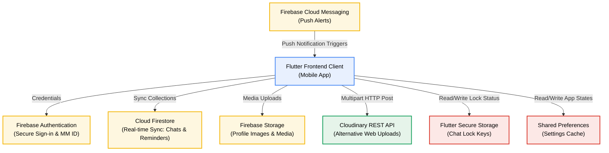
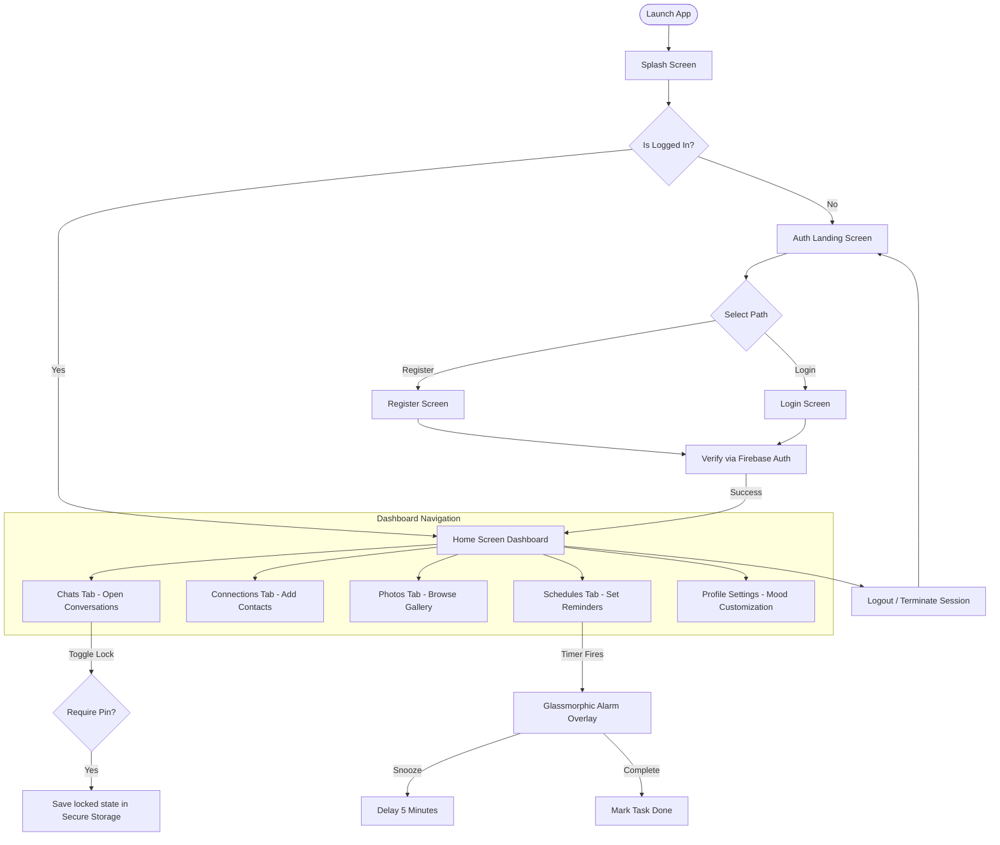

# 🌈 mmwelconm - Social Connection Platform

### **Connect Your Mood. Share Your Status. Stay Close.**

A premium, Flutter-based social utility designed exclusively for close circles—family, friends, and romantic partners—to share real-time moods, coordinate availability, and manage interactive reminders in a private, secure environment.

---

## 🛠️ Tech Stack & Badges

[](https://flutter.dev)
[](https://dart.dev)
[](https://firebase.google.com)
[](https://cloudinary.com)
[](https://github.com)

---

## 📋 Table of Contents

- [Project Metadata](#project-metadata)
- [1. Project Overview](#1-project-overview)
- [2. Problem Statement](#2-problem-statement)
- [3. Solution](#3-solution)
- [4. Features](#4-features)
- [5. Technology Stack](#5-technology-stack)
- [6. System Architecture](#6-system-architecture)
- [7. UI Design](#7-ui-design)
- [8. Project Workflow](#8-project-workflow)
- [9. Folder Structure](#9-folder-structure)
- [10. Installation](#10-installation)
- [11. Usage](#11-usage)
- [12. Challenges Faced](#12-challenges-faced)
- [13. Future Improvements](#13-future-improvements)
- [14. Conclusion](#14-conclusion)
- [15. References](#15-references)
- [16. License](#16-license)

---

## Project Metadata

* **Project Title:** MMWelconm – Community Connection Platform
* **Version:** 1.0
* **Author:** Asma Begum Mohd.
* **Date:** July 2026

---

## 1. Project Overview

**mmwelconm** is a private, real-time social connection mobile and web platform. It is engineered to keep close-knit circles—family members, close friend groups, and partners—synchronized and updated with each other's schedules and availability. Unlike traditional broadcasting networks, mmwelconm focuses on a localized utility: enabling users to share their current mood status, coordinate plans, drop media, and set contextual alerts. 

By structuring the user base around selective connection requests and relation-specific categories, mmwelconm bridges the gap between messaging apps and scheduling tools, providing a unified space for genuine, everyday connections.

---

## 2. Problem Statement

Modern social networks focus on high-frequency content broadcasting, which leads to public oversharing, notification fatigue, and a decline in digital privacy. When it comes to maintaining contact with immediate circles (e.g., checking if a parent got home, if a spouse is in a meeting, or if a friend is free to talk), users must rely on repetitive manual check-ins ("Are you busy?", "Where are you?"). 

Standard messaging apps do not convey ambient context like active schedules, on-call states, or emotional availability. There is a lack of private utility apps that automate these context-sharing operations while respecting user boundaries and local privacy settings.

---

## 3. Solution

**mmwelconm** addresses these issues through a specialized, real-time notification and sharing ecosystem:
* **Relationship-Categorized Channels:** Conversations and contacts are organized into distinct relationship streams—Family, Friends, and Partners—each styled with its own theme (Blue, Purple, and Pink) to match user expectations.
* **Ambient Mood Tracking:** Users can set dynamic mood status emojis and text that display immediately to their circles, reducing the need for constant "How are you?" texts.
* **Smart Reminders & Alarms:** Implements an in-chat reminder system where users can turn a received text message into a calendar reminder, triggering a full-screen, high-priority glassmorphic alarm overlay on the device.
* **Granular Privacy & Security:** Features local chat locks powered by secure hardware keystores and location-sharing toggles to prevent unauthorized viewing.

---

## 4. Features

### 🔐 User Profiles & Authentication
* **Unique MM ID Generation:** Upon registration, users receive a unique identifier formatted as `MMXXXXXX`. Contacts search and send invites using this ID.
* **Interactive Profile Customization:** Custom avatars, profile pictures, and bios are saved securely to cloud storage.
* **Online/Offline Visibility:** Users can toggle their active status in the settings menu.

### 💬 Rich, Group-Categorized Chat
* **Categorized Themes:** Direct and group chats dynamically color-code based on relation:
  * 🏠 **Family Theme (Blue)**
  * 👯 **Friends Theme (Purple)**
  * ❤️ **Partner Theme (Pink)**
* **Advanced Message Management:** Features real-time double-tick read receipts, unread message badges, message editing (within 15 minutes), single message deletion, multi-message selection for bulk operations, and full chat session clearing.
* **Media Uploads:** Send media directly from the device gallery or snap photos with the camera.

### ⏰ Schedules & Event Reminders
* **Integrated Schedulers:** Dedicated dashboard to add, check, and delete user-defined tasks.
* **Text-to-Task Conversion:** Long-pressing a chat message allows users to instantly import it as a scheduled task.
* **Overlay Alarm System:** At the scheduled time, a full-screen glassmorphic alarm overlay takes focus, prompting the user to either **Snooze (5 min)** or **Complete** the task.

### 🔒 Privacy Controls
* **Chat Lock Manager:** Users can apply PIN or pattern locks to specific private chats, using secure device storage key persistence.
* **Privacy Toggle:** Turn off active location or status shares on a per-contact basis.

---

## 5. Technology Stack

| Category | Technology | Usage in Project |
| :--- | :--- | :--- |
| **Frontend** | Flutter / Dart | Native Android & iOS user interface, responsive layout, animations. |
| **Backend Services** | Firebase (Auth, Firestore, Messaging) | User authorization, real-time database sync, cloud messaging. |
| **Media Hosting** | Cloudinary REST API & Firebase Storage | Multi-platform image hosting (Base64/multipart uploads). |
| **Local Storage** | Flutter Secure Storage & SharedPreferences | Local settings cache and encrypted chat lock keys. |
| **Local Alerts** | `flutter_local_notifications` | Scheduling low-level background timers and system-level alarms. |
| **Tools & Workspace** | VS Code, Git, GitHub, Android SDK | Development environments, branch management, and deployment. |

---

## 6. System Architecture

The following diagram illustrates how the Flutter client interacts with Firebase Core, local storage modules, and external REST APIs like Cloudinary:



---

## 7. UI Design

The app includes highly responsive, beautifully animated views tailored to relationship types. The major pages are structured as follows:

* **Authentication Pages:** Allows users to securely sign in or register a new profile. Shows landing screens, error feedback, and MM ID allocation details.
* **Home Dashboard:** A centralized screen utilizing custom widgets to highlight user mood states, navigation tabs, and immediate notifications.
* **Relationship Chats:** Displays conversations organized under specific family (blue), friend (purple), and partner (pink) color palettes with integrated image sending.
* **Connection Requests:** Search bar interface to add contacts by unique MM ID, alongside inbound/outbound request boards.
* **Smart Reminders Dashboard:** List of upcoming task reminders and alarm toggle configurations.
* **Profile Settings:** View details about your profile, update current mood emoji labels, toggle online status, and set global privacy properties.

---

## 8. Project Workflow

The functional routing and process flow of the application are represented in the flowchart below:



---

## 9. Folder Structure

The structural layout of the codebase represents a clean separation of models, service blocks, views, and custom widgets:

```
mmwelconm/
├── android/                         # Android native configurations and build scripts
├── ios/                             # iOS native config and assets
├── assets/
│   └── logo.png                     # App branding asset
├── lib/
│   ├── main.dart                    # App initialization, routes & background processes
│   ├── firebase_options.dart        # Auto-generated Firebase client configs
│   ├── models/
│   │   ├── chat_model.dart          # Message & chat session schemas
│   │   ├── contact_model.dart       # Friendship statuses and relationships
│   │   ├── mood_model.dart          # Mood status emojis and text structures
│   │   ├── reminder_model.dart      # Task description, scheduled datetime & status
│   │   └── user_model.dart          # User details, status, photo fields & MM ID
│   ├── screens/
│   │   ├── auth_landing_screen.dart # Initial gateway page
│   │   ├── chat_detail_screen.dart  # Message history, read receipts, and settings
│   │   ├── chats_screen.dart        # Chat list categorized by relations
│   │   ├── connections_screen.dart  # Contacts and incoming request list
│   │   ├── create_group_screen.dart # Group setup dialog
│   │   ├── home_screen.dart         # Main UI shell hosting navigation tabs
│   │   ├── login_screen.dart        # Email-based login interface
│   │   ├── photos_screen.dart       # Shared image board
│   │   ├── privacy_settings_screen.dart # Location and status toggles
│   │   ├── profile_screen.dart      # Current user bio and mood configurator
│   │   ├── register_screen.dart     # Signup interface with profile pic upload
│   │   ├── reminders_screen.dart    # Calendar schedules and alarm configurations
│   │   ├── requests_screen.dart     # Friend requests review panel
│   │   ├── settings_screen.dart     # System parameters and notifications toggles
│   │   └── splash_screen.dart       # Splash loader screen
│   ├── services/
│   │   ├── auth_service.dart        # Sign-in, Register, and Session management
│   │   ├── cloudinary_service.dart  # Direct HTTP upload to Cloudinary buckets
│   │   ├── firestore_service.dart   # Transactional reads/writes to DB collections
│   │   ├── lock_manager.dart        # Secure storage encryption key controls
│   │   ├── notification_service.dart# FCM listeners and local system notification alarms
│   │   └── storage_service.dart     # Cloud storage references and upload helpers
│   └── widgets/
│       ├── app_brand.dart           # Reusable logo and text assets
│       └── notification_card.dart   # In-app drop-down notification cards
└── pubspec.yaml                     # Project plugins and assets register
```

---

## 10. Installation

Follow these steps to deploy and run the project locally on your machine:

### Prerequisites
* **Flutter SDK:** installed on your system (minimum Version `3.12.1` or newer)
* **IDE:** VS Code or Android Studio with Flutter/Dart plugins installed
* **Platform Emulator:** An active Android Emulator, iOS Simulator, or connected development device with USB debugging enabled.

### Setup Instructions
1. **Clone the Repository:**
   ```bash
   git clone https://github.com/mohdasmabegum/mmwelconm.git
   cd mmwelconm
   ```
2. **Get Dependencies:**
   ```bash
   flutter pub get
   ```
3. **Configure Firebase:**
   Ensure your Firebase project is created, and place the configuration files in their respective folders:
   * **Android:** Download `google-services.json` and place it in the `android/app/` folder.
   * **iOS:** Download `GoogleService-Info.plist` and place it in the `ios/Runner/` folder.
   Alternatively, run `flutterfire configure` to generate the `firebase_options.dart` file automatically.
4. **Launch the Application:**
   ```bash
   flutter run
   ```

---

## 11. Usage

1. **Sign Up & Account Setup:** Complete your register profile by adding your name, choosing an avatar, and obtaining your unique `MMXXXXXX` user ID.
2. **Add Connections:** Go to the **Connections** tab. Search for a friend using their unique MM ID. Select their relationship type (Family, Friend, or Partner) and send a request.
3. **Set your Mood:** Update your current state on the **Profile** screen (e.g., Happy, Busy, Tired). Your mood will change on the homescreens of your connected contacts.
4. **Chat & Send Photos:** Open a conversation. Depending on the relationship type, the theme will auto-update. Send text or upload photos.
5. **Schedule a Reminder:** Long-press a received message in a chat and click "Schedule as Reminder". Define the date and time.
6. **Task Execution:** When the schedule triggers, the app will launch a glassmorphic overlay alarm that can be snoozed or cleared directly.

---

## 12. Challenges Faced

### Challenge 1: System-Level Overlay Alarms on Android 10+
* **Issue:** Android's modern security constraints restrict applications from launching full-screen overlays (draw-over-other-apps) when running in the background. Initially, the schedules would fire silently or crash when the screen was locked.
* **Resolution:** Resolved by implementing custom notification channels with high urgency parameters in `NotificationService`. Android users are prompted on first run to explicitly grant `SYSTEM_ALERT_WINDOW` permission. When the local alarm triggers, we invoke a native system overlay drawing a translucent glassmorphic frame, ensuring the alert takes immediate focus.

### Challenge 2: Synchronous DB Batches for Friendship Request Cycles
* **Issue:** Handling bidirectional friend requests in Firestore can lead to inconsistent database states if one writes successfully but the other fails (e.g., recipient gains pending status but sender fails to record it).
* **Resolution:** Migrated connection cycles to Firestore `WriteBatch` operations inside `FirestoreService.sendContactRequest`. This groups the dual writes for the sender's subcollection and the recipient's subcollection into a single atomic transaction. Either both records succeed, or the entire process rolls back.

### Challenge 3: Cross-Platform Media Upload Support (Web vs Mobile)
* **Issue:** Traditional Flutter image pickers return file system references (`File`) that are incompatible with Web compilation, causing file-not-found compile errors.
* **Resolution:** Created a specialized utility class `CloudinaryService` that abstracts media uploads. On native mobile builds, it uploads directly to Firebase Storage using file paths. On web platforms, it reads the image as a byte array (`Uint8List`) and dispatches it directly to Cloudinary's HTTP multipart interface, ensuring platform-agnostic media sharing.

---

## 13. Future Improvements

* **Analytics Integration:** Introduce monthly mood dashboards containing heatmaps, showing emotional health trends over 30-day periods.
* **Dijkstra-Driven Proximity Navigation:** Integrate maps to highlight real-time proximity alerts (e.g. "Friend is within 500m") with path calculations.
* **End-to-End Encryption (E2EE):** Upgrade the chat services so that message payloads are encrypted locally before syncing to Cloudinary/Firebase Firestore.
* **Dynamic Custom Themes:** Allow users to build customized color schemes and icons for custom relationship roles.

---

## 14. Conclusion

**mmwelconm** successfully creates a private social environment where close contacts can share moods, chat, and keep track of coordinate tasks easily. By replacing complex public-facing feeds with direct, relation-specific utility dashboards, it demonstrates how structured cloud architectures can solve daily coordination pain points. This project provided hands-on experience in:
* Implementing multi-layered Firebase architectures (Auth, Firestore, Messaging).
* Platform-level Android channel development for high-urgency notifications.
* Designing and building secure local key caches with hardware-backed encryption.

---

## 15. References

1. **Flutter Documentation:** https://docs.flutter.dev
2. **Firebase Auth and Firestore Docs:** https://firebase.google.com/docs
3. **Cloudinary REST Upload API:** https://cloudinary.com/documentation/image_upload_api_reference
4. **Flutter Local Notifications package:** https://pub.dev/packages/flutter_local_notifications

---

## 16. License

This project is licensed under the **MIT License** - see the LICENSE file for details.
